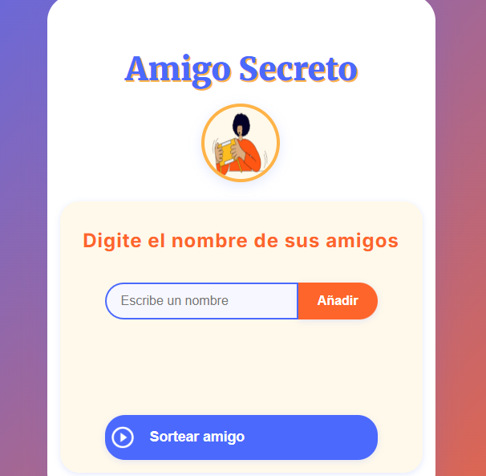
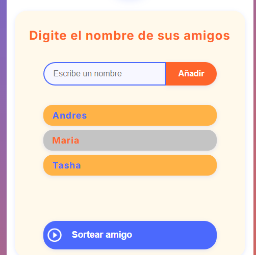
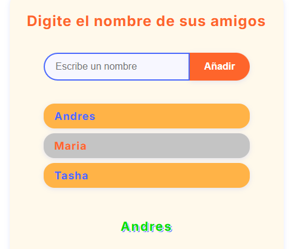

# 🎁 Challenge Amigo Secreto - Alura LATAM

Este es un proyecto realizado como parte de los **Challenges de Alura LATAM**, donde se desarrolla una aplicación interactiva para organizar un sorteo de "Amigo Secreto".

## 📌 Descripción

La aplicación permite a los usuarios escribir los nombres de sus amigos y, al finalizar, realizar un sorteo para asignar aleatoriamente a cada participante otro amigo como su "Amigo Secreto". Una forma divertida y automatizada de organizar este clásico juego.

## 💻 Tecnologías utilizadas

- 🌐 **HTML** – Estructura del sitio
- 🎨 **CSS** – Estilos visuales
- ⚙️ **JavaScript** – Lógica del sorteo y funcionalidades interactivas

## 📷 Captura de pantalla

Vista inicial de la aplicación:

Vista con nombres agregados:

Vista con nombre ganador:

## 🚀 Entra al siguiente enlace para la demo

https://iandrestm.github.io/challenge-amigo-secreto/
